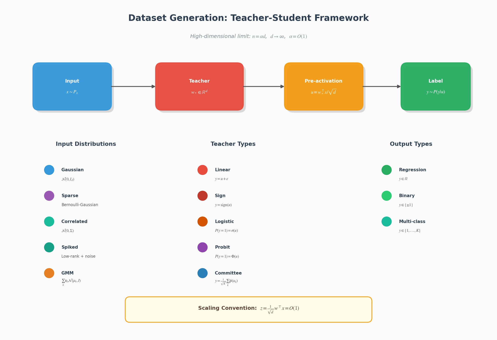
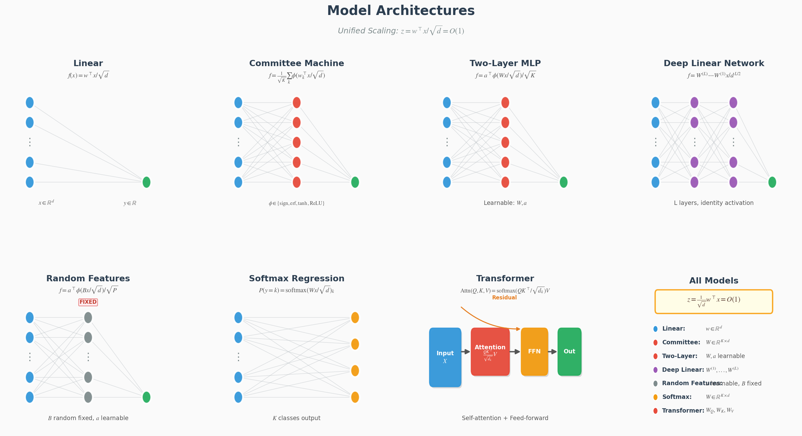

<p align="center">
  
</p>

<h1 align="center">StatPhys-ML</h1>

<p align="center">
  <strong>Statistical Mechanics Simulation Package for Machine Learning</strong>
</p>

<p align="center">
  <a href="https://www.python.org/downloads/"></a>
  <a href="LICENSE.txt"></a>
  <a href="https://github.com/psf/black"></a>
</p>

<p align="center">
  A powerful Python package for <strong>Teacher-Student model</strong> analysis using <strong>statistical mechanics</strong> methods.
</p>

## Features

- **Dataset Generation**: 22 customizable datasets including Gaussian, sparse, structured, GLM, ICL tasks, sequences/tokens, attention-indexed, fairness, and noisy labels
- **Learning Models**: 19 models including linear, committee machines, two-layer networks, deep linear, random features, softmax, transformers, and sequence models (LSA, SSM, RNN, Hopfield)
- **Loss Functions**: MSE, Ridge, LASSO, Huber, Hinge, Logistic, Probit, Softmax cross-entropy, and more
- **Theory Solvers**:
  - **Replica Method**: Saddle-point equation solver with damping and continuation
  - **Online Learning**: ODE solver for learning dynamics with adaptive stepping
  - **DMFT**: Coming soon
- **Simulation Framework**: Unified interface for experiments with automatic theory comparison
- **Visualization**: Publication-quality plots for theory vs experiment comparison
- **Utility Functions**: Special functions, Gaussian integrals (Gauss-Hermite/numerical quadrature), proximal operators

## Installation

### From source (recommended for development)

```bash
git clone https://github.com/yuma-ichikawa/statphys-ml.git
cd statphys-ml
pip install -e ".[dev]"
```

### Using uv (faster)

```bash
uv pip install -e ".[dev]"
```

## Quick Start

### Example: Ridge Regression with Replica Theory

```python
import statphys
from statphys.dataset import GaussianDataset
from statphys.model import LinearRegression
from statphys.loss import RidgeLoss
from statphys.simulation import ReplicaSimulation, SimulationConfig
from statphys.vis import ComparisonPlotter

# Fix random seed
statphys.fix_seed(42)

# Create dataset with linear teacher
dataset = GaussianDataset(d=500, rho=1.0, eta=0.1)

# Configure simulation
config = SimulationConfig.for_replica(
    alpha_range=(0.1, 5.0),  # Sample ratio range
    alpha_steps=20,
    n_seeds=5,
    reg_param=0.01,
)

# Run simulation
sim = ReplicaSimulation(config)
results = sim.run(
    dataset=dataset,
    model_class=LinearRegression,
    loss_fn=RidgeLoss(0.01),
)

# Visualize results
plotter = ComparisonPlotter()
plotter.plot_theory_vs_experiment(results)
```

### Example: Online SGD Dynamics

```python
from statphys.simulation import OnlineSimulation, SimulationConfig
from statphys.theory.online import ODESolver, OnlineSGDEquations

# Configure online simulation
config = SimulationConfig.for_online(
    t_max=10.0,  # Maximum time (t = n/d)
    t_steps=100,
    n_seeds=5,
)

# Create theory solver
theory_solver = ODESolver(
    equations=OnlineSGDEquations(rho=1.0, lr=0.1),
    order_params=["m", "q"],
)

# Run simulation with theory comparison
sim = OnlineSimulation(config)
results = sim.run(
    dataset=dataset,
    model_class=LinearRegression,
    loss_fn=RidgeLoss(0.01),
    theory_solver=theory_solver,
)
```

## Supported Components

### Datasets (22 types)

| Category | Class | Description |
|----------|-------|-------------|
| **Gaussian** | `GaussianDataset` | Standard i.i.d. Gaussian input with linear teacher |
| | `GaussianClassificationDataset` | Sign teacher for binary classification |
| | `GaussianMultiOutputDataset` | Multi-output teacher (committee-style) |
| **Sparse** | `SparseDataset` | Sparse input distribution |
| | `BernoulliGaussianDataset` | Bernoulli-Gaussian mixture input |
| **Structured** | `StructuredDataset` | Arbitrary covariance matrix |
| | `CorrelatedGaussianDataset` | Exponentially correlated input |
| | `SpikedCovarianceDataset` | Spiked covariance model |
| **GLM Teachers** | `LogisticTeacherDataset` | Logistic teacher: P(y=1\|u) = σ(u) |
| | `ProbitTeacherDataset` | Probit teacher: P(y=1\|u) = Φ(u) |
| **Gaussian Mixture** | `GaussianMixtureDataset` | Binary GMM (for DMFT analysis) |
| | `MulticlassGaussianMixtureDataset` | Multi-class GMM |
| **ICL Tasks** | `ICLLinearRegressionDataset` | ICL task with linear teacher (for LSA analysis) |
| | `ICLNonlinearRegressionDataset` | ICL task with nonlinear (2-layer) teacher |
| **Sequence/Token** | `MarkovChainDataset` | Markov chain sequences (for induction head) |
| | `CopyTaskDataset` | Copy/trigger task (induction head emergence) |
| | `GeneralizedPottsDataset` | Language-like Potts sequences (Phys. Rev. 2024) |
| | `TiedLowRankAttentionDataset` | Position-semantics phase transition (NeurIPS 2024) |
| | `MixedGaussianSequenceDataset` | Correlated token sequences with latent clusters |
| **Attention** | `AttentionIndexedModelDataset` | AIM for Bayes-optimal attention (arXiv 2025) |
| **Fairness** | `TeacherMixtureFairnessDataset` | Fairness/bias with group teachers (ICML 2024) |
| **Noisy Labels** | `NoisyGMMSelfDistillationDataset` | Label noise for self-distillation (2025) |

<p align="center">
  
</p>
<p align="center"><em>Teacher-Student framework for data generation</em></p>

### Models (19 types)

| Category | Class | Description |
|----------|-------|-------------|
| **Linear** | `LinearRegression` | Linear regression with (1/√d) scaling |
| | `LinearClassifier` | Linear classifier (sign/logit/prob output) |
| | `RidgeRegression` | Ridge regression wrapper |
| **Committee** | `CommitteeMachine` | Hard committee (sign activation) |
| | `SoftCommitteeMachine` | Soft committee (erf/tanh/relu) |
| **MLP** | `TwoLayerNetwork` | Two-layer network with various activations |
| | `TwoLayerNetworkReLU` | Two-layer ReLU network |
| | `DeepNetwork` | Multi-layer network |
| **Deep Linear** | `DeepLinearNetwork` | Deep linear network (identity activation) |
| **Random Features** | `RandomFeaturesModel` | Random features / kernel approximation |
| | `KernelRidgeModel` | Kernel ridge regression wrapper |
| **Softmax** | `SoftmaxRegression` | Multi-class softmax regression |
| | `SoftmaxRegressionWithBias` | Softmax with bias terms |
| **Transformer** | `SingleLayerAttention` | Single attention layer |
| | `SingleLayerTransformer` | Full single-layer transformer |
| **Sequence Models** | `LinearSelfAttention` | Linear self-attention (LSA) for ICL theory |
| | `StateSpaceModel` | State space model (SSM) for sequences |
| | `LinearRNN` | Linear recurrent neural network |
| **Energy-Based** | `ModernHopfieldNetwork` | Modern Hopfield network (attention ≈ energy min) |

<p align="center">
  
</p>
<p align="center"><em>Supported model architectures with unified scaling convention</em></p>

### Loss Functions (16 types)

| Category | Class | Formula |
|----------|-------|---------|
| **Regression** | `MSELoss` | ½(y - ŷ)² |
| | `RidgeLoss` | MSE + λ\|\|w\|\|² |
| | `LassoLoss` | MSE + λ\|\|w\|\|₁ |
| | `ElasticNetLoss` | MSE + λ₁\|\|w\|\|₁ + λ₂\|\|w\|\|² |
| | `HuberLoss` | Smooth robust loss |
| | `PseudoHuberLoss` | Differentiable Huber |
| **Binary Classification** | `CrossEntropyLoss` | Binary cross-entropy |
| | `LogisticLoss` | log(1 + exp(-y·ŷ)) |
| | `HingeLoss` | max(0, 1 - y·ŷ) |
| | `SquaredHingeLoss` | max(0, 1 - y·ŷ)² |
| | `PerceptronLoss` | max(0, -y·ŷ) |
| | `ExponentialLoss` | exp(-y·ŷ) |
| | `RampLoss` | Bounded hinge loss |
| | `ProbitLoss` | -log(Φ(y·ŷ)) |
| **Multi-class** | `SoftmaxCrossEntropyLoss` | Softmax + cross-entropy |
| | `MultiMarginLoss` | Multi-class hinge (Crammer-Singer) |

### Theory Equations

#### Replica Method (6 equations)

| Class | Problem |
|-------|---------|
| `RidgeRegressionEquations` | Ridge regression saddle-point equations |
| `LassoEquations` | LASSO with soft-thresholding |
| `LogisticRegressionEquations` | Logistic regression |
| `PerceptronEquations` | Perceptron/SVM (Gardner volume) |
| `ProbitEquations` | Probit classification |
| `CommitteeMachineEquations` | Committee machine (symmetric ansatz) |

#### Online Learning (7 equations)

| Class | Problem |
|-------|---------|
| `OnlineSGDEquations` | Online SGD for linear regression |
| `OnlineRidgeEquations` | Online ridge regression |
| `OnlinePerceptronEquations` | Online perceptron learning |
| `OnlineLogisticEquations` | Online logistic regression |
| `OnlineHingeEquations` | Online SVM/hinge loss |
| `OnlineCommitteeEquations` | Online committee machine |

### Utility Functions

#### Special Functions (`statphys.utils.special_functions`)

| Function | Description |
|----------|-------------|
| `gaussian_pdf`, `gaussian_cdf`, `gaussian_tail` | Gaussian distribution functions |
| `Phi`, `H`, `phi` | Standard notation aliases |
| `erf_activation`, `erf_derivative` | Error function activation |
| `sigmoid`, `sigmoid_derivative` | Sigmoid and derivative |
| `I2`, `I3`, `I4` | Committee machine correlation functions |
| `soft_threshold`, `firm_threshold` | Proximal operators |
| `classification_error_linear`, `regression_error_linear` | Generalization error formulas |

#### Numerical Integration (`statphys.utils.integration`)

| Function | Description |
|----------|-------------|
| `gaussian_integral_1d` | Univariate Gaussian integral |
| `gaussian_integral_2d` | Bivariate Gaussian integral |
| `gaussian_integral_nd` | Multivariate Gaussian integral |
| `teacher_student_integral` | Joint (u, z) integral for teacher-student |
| `conditional_expectation` | E[f(z) \| u] or E[f(u) \| z] |

**Integration Methods:**
- `hermite`: Gauss-Hermite quadrature (efficient, recommended)
- `quad`: Scipy adaptive quadrature (for difficult integrands)
- `monte_carlo`: Monte Carlo sampling (for high dimensions)

## Package Structure

```
src/statphys/
├── dataset/          # Data generation (22 classes)
│   ├── gaussian.py   # Gaussian, Classification, MultiOutput
│   ├── sparse.py     # Sparse, BernoulliGaussian
│   ├── structured.py # Structured, Correlated, Spiked
│   ├── glm.py        # Logistic, Probit, GaussianMixture teachers
│   ├── icl.py        # ICL linear/nonlinear regression tasks
│   ├── sequence.py   # Markov, Copy, Potts, TiedAttention, MixedSequence
│   ├── attention.py  # AttentionIndexedModel (AIM)
│   ├── fairness.py   # TeacherMixtureFairness
│   └── noisy.py      # NoisyGMMSelfDistillation
├── model/            # Learning models (19 classes)
│   ├── linear.py     # LinearRegression, Classifier, Ridge
│   ├── committee.py  # CommitteeMachine, SoftCommittee
│   ├── mlp.py        # TwoLayerNetwork, DeepNetwork
│   ├── random_features.py # RandomFeatures, KernelRidge, DeepLinear
│   ├── softmax.py    # SoftmaxRegression
│   ├── transformer.py # Attention, Transformer
│   └── sequence.py   # LSA, SSM, RNN, Hopfield (NEW)
├── loss/             # Loss functions (16 classes)
│   ├── regression.py # MSE, Ridge, LASSO, ElasticNet, Huber
│   └── classification.py # Hinge, Logistic, Probit, Softmax, etc.
├── theory/           # Theoretical calculations
│   ├── replica/      # Replica method (6 equations)
│   │   ├── solver.py # SaddlePointSolver
│   │   ├── equations.py # Ridge, LASSO, Logistic, Perceptron, Probit, Committee
│   │   └── integration.py # Gaussian integration utilities
│   └── online/       # Online learning (7 equations)
│       ├── solver.py # ODESolver, AdaptiveODESolver
│       └── equations.py # SGD, Ridge, Perceptron, Logistic, Hinge, Committee
├── simulation/       # Numerical experiments
│   ├── replica_sim.py # ReplicaSimulation
│   └── online_sim.py  # OnlineSimulation
├── vis/              # Visualization
│   ├── comparison.py # ComparisonPlotter
│   ├── phase_diagram.py # PhaseDiagramPlotter
│   └── default_plots.py # Publication-quality default plots
└── utils/            # Utilities
    ├── special_functions.py # Special functions for stat mech
    ├── integration.py # Gaussian integrals (Hermite/quad/MC)
    ├── math.py        # Basic math utilities
    ├── seed.py        # Random seed management
    └── io.py          # Results I/O
```

## Key Concepts

### Order Parameters

In the high-dimensional limit (d → ∞), learning can be characterized by a few order parameters:

- **m**: Overlap with teacher weights (generalization measure)
- **q**: Self-overlap of student weights
- **E_g**: Generalization error

### Sample Ratio α = n/d

The sample ratio α determines the learning regime:
- α < 1: Underdetermined (interpolation)
- α = 1: Transition point
- α > 1: Overdetermined

### Theory Types

1. **Replica Method**: For analyzing the asymptotic (n, d → ∞) behavior of batch learning
2. **Online Learning**: For analyzing single-sample SGD dynamics

## Running Tests

```bash
# Run all tests
pytest tests/

# Run with coverage
pytest tests/ --cov=statphys

# Run specific test file
pytest tests/test_dataset.py
```

## Examples

See the `examples/` directory:

| File | Description |
|------|-------------|
| `basic_usage.ipynb` | Comprehensive tutorial covering all features |
| `dataset_gallery.ipynb` | Visualization of all 16 supported datasets |
| `model_gallery.ipynb` | Visualization of all 19 supported models |
| `replica_ridge_regression.py` | Ridge regression with replica theory |
| `online_sgd_learning.py` | Online SGD dynamics |
| `committee_machine.py` | Committee machine analysis |

## Dependencies

- Python >= 3.10
- PyTorch >= 2.0
- NumPy >= 1.24
- SciPy >= 1.10
- Matplotlib >= 3.7


## License

BSD-3-Clause License - see [LICENSE.txt](LICENSE.txt) for details.

## Contributing

Contributions are welcome! Please read our [Contributing Guide](CONTRIBUTING.md) and [Code of Conduct](CODE_OF_CONDUCT.md) before submitting a Pull Request.

## Citation

If you use this package in your research, please cite:

```bibtex
@software{ichikawa2025statphysml,
  author       = {Ichikawa, Yuma},
  title        = {{StatPhys-ML}: Statistical Mechanics Simulation Package for Machine Learning},
  year         = {2025},
  month        = feb,
  version      = {0.1.0},
  publisher    = {GitHub},
  url          = {https://github.com/yuma-ichikawa/statphys-ml},
  note         = {Python package for Teacher-Student model analysis using replica method and online learning theory}
}
```

For BibTeX users who prefer `@misc`:

```bibtex
@misc{ichikawa2025statphysml,
  author       = {Ichikawa, Yuma},
  title        = {{StatPhys-ML}: Statistical Mechanics Simulation Package for Machine Learning},
  year         = {2025},
  howpublished = {\url{https://github.com/yuma-ichikawa/statphys-ml}},
  note         = {Version 0.1.0}
}
```

## Author

**Yuma Ichikawa, Ph.D.**

- **Website**: [https://ichikawa-laboratory.com/](https://ichikawa-laboratory.com/)
- **Twitter**: [@yuma_1_or](https://x.com/yuma_1_or)
- **Google Scholar**: [Yuma Ichikawa](https://scholar.google.com/citations?user=yuma-ichikawa)
- **GitHub**: [yuma-ichikawa](https://github.com/yuma-ichikawa)

### Research Topics

- **Statistical Mechanics**: Information Statistical Mechanics, Spin Glass, Phase Transition, Markov Chain Monte Carlo
- **Learning Theory**: High-Dimensional Statistics, Learning Dynamics
- **Combinatorial Optimization**: Learning for Optimization, Heuristics, Simulated Annealing
- **Large Language Model (LLM)**: Architecture, Compression, Quantization, Pruning

### Contact

- **Email**: yuma.ichikawa@a.riken.jp

## Disclaimer

This project is an **independent personal project** developed by Yuma Ichikawa.
It is **not affiliated with, sponsored by, or endorsed by any organization**, including the author's employer.
All views and opinions expressed in this project are solely those of the author.

