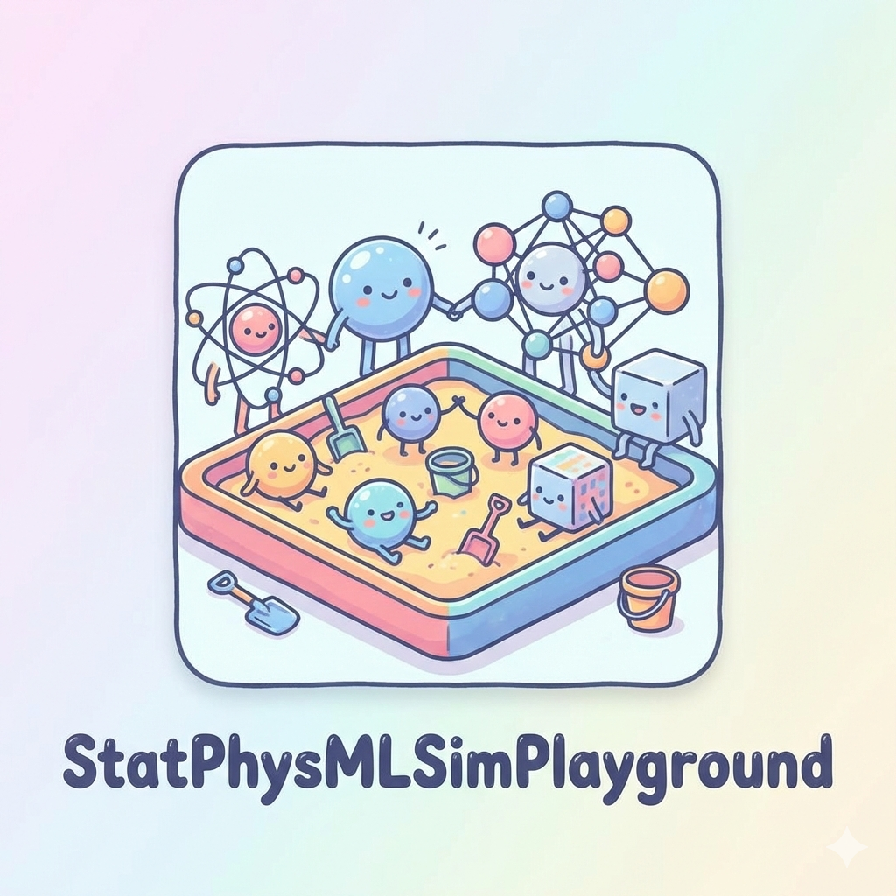
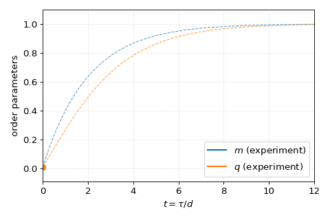
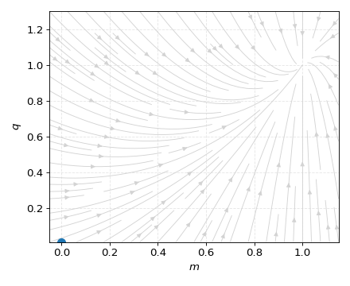
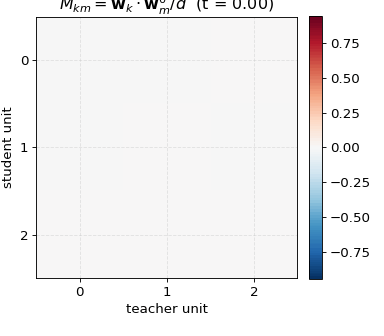

<p align="center">
  
</p>

<h1 align="center">StatPhys-ML</h1>

<p align="center">
  <strong>Statistical Mechanics Simulation Package for Machine Learning</strong>
</p>

<p align="center">
  <a href="https://www.python.org/downloads/"></a>
  <a href="LICENSE.txt"></a>
  <a href="https://github.com/psf/black"></a>
</p>

<p align="center">
  A Python package for <strong>Teacher-Student model</strong> analysis using <strong>statistical mechanics</strong> methods — replica theory, online-learning ODEs, and theory-free experiments for arbitrary architectures.
</p>

<p align="center">
  
  
</p>
<p align="center">
  
</p>
<p align="center"><em>
  Left: online SGD order parameters (solid) converging onto the exact ODE theory (dashed).
  Right: the same dynamics moving through the (m, q) phase plane over the theoretical flow field.
  Bottom: a soft committee machine <strong>specializing</strong> — the student-teacher overlap matrix developing a diagonal during training.
  Reproduce with <code>python scripts/generate_readme_assets.py</code>.
</em></p>

## Features

- **Theory solvers**: replica saddle-point equations (6 scenarios) and online-learning ODEs (6 scenarios), with automatic theory-vs-experiment comparison
- **22 datasets / 19 models / 16 losses**: from Gaussian linear teachers to ICL tasks, sequence models, and attention-indexed models
- **General teacher-student experiments**: theory-free numerical experiments for *any* PyTorch model, with structured teacher weights (sparse, low-rank, spiked, power-law, ...) and configurable input distributions
- **Architecture zoo**: matched teacher-student pairs for linear / MLP / deep MLP / CNN / LSTM / attention / tiny-GPT
- **Visualization**: publication-quality plots, phase portraits, overlap-matrix heatmaps, and GIF/MP4 animations
- **Slurm integration**: programmatic sbatch generation and job arrays, no hardcoded cluster paths
- **One-liner API**: `quick_online()`, `quick_replica()`, `quick_experiment()`

## Installation

```bash
git clone https://github.com/yuma-ichikawa/statphys-ml.git
cd statphys-ml
pip install -e ".[dev]"        # or: uv pip install -e ".[dev]"
```

Requires Python ≥ 3.10 (PyTorch, NumPy, SciPy, Matplotlib, pandas are installed automatically).

## Quick Start

```python
import statphys

# Online SGD vs exact ODE theory (linear regression), with plots
result = statphys.quick_online(d=400, lr=0.5, t_max=10)

# Ridge regression at several alpha = n/d vs replica theory
result = statphys.quick_replica(d=200, reg_param=0.1)

# Theory-free teacher-student experiment (works for any architecture)
result = statphys.quick_experiment("random_mlp", alphas=[1, 2, 4, 8])
```

For arbitrary architectures — including LLM-style transformers where no analytic theory exists:

```python
from statphys.experiment import architecture_experiment

exp = architecture_experiment("tiny_gpt", d=256, teacher_init="normal")
result = exp.run_sample_complexity(alphas=[2, 4, 8, 16], n_seeds=3)
result.plot(logy=True)
```

Verify the whole architecture zoo locally or as a Slurm job array:

```bash
python scripts/verify_architectures.py --arch all
python scripts/verify_architectures.py --submit-slurm --partition <name> --gpus 1
```

Run the test suite with `pytest tests/`.

## Documentation

Detailed documentation lives in [`docs/`](docs/README.md):

| Guide | Contents |
|---|---|
| [Getting Started](docs/getting_started.md) | Installation, one-liner API, full replica/online workflows |
| [Component Catalog](docs/components.md) | All datasets, models, losses, theory scenarios, and utilities |
| [General Experiments](docs/experiments.md) | Theory-free teacher-student framework, presets, architecture zoo |
| [Visualization](docs/visualization.md) | Plotters, phase portraits, and GIF/MP4 animations |
| [Slurm Guide](docs/slurm.md) | Cluster execution: single jobs, arrays, verification CLI |
| [Key Concepts](docs/concepts.md) | Order parameters, $E_g$ formulas, scaling conventions |
| [Theory & Literature](docs/THEORY.md) | Feature ↔ paper map; exact vs heuristic status |
| [Package Structure](docs/package_structure.md) | Source-tree layout and design conventions |

## Examples

See the [`examples/`](examples/) directory:

| File | Description |
|------|-------------|
| `basic_usage.ipynb` | Comprehensive tutorial covering all features |
| `dataset_gallery.ipynb` | Visualization of all 22 supported datasets |
| `model_gallery.ipynb` | Visualization of all 19 supported models |
| `theory_vs_simulation_verification_en.ipynb` | Theory vs simulation walkthrough (also [日本語](examples/theory_vs_simulation_verification_ja.ipynb)) |
| `replica_ridge_regression.py` | Ridge regression with replica theory |
| `online_sgd_learning.py` | Online SGD dynamics |
| `committee_machine.py` | Committee machine analysis |
| `general_teacher_student.py` | Theory-free experiments (sparse recovery, attention teacher, custom setups) |

## License

BSD-3-Clause License — see [LICENSE.txt](LICENSE.txt) for details.

## Contributing

Contributions are welcome! Please read our [Contributing Guide](CONTRIBUTING.md) and [Code of Conduct](CODE_OF_CONDUCT.md) before submitting a Pull Request.

## Citation

If you use this package in your research, please cite:

```bibtex
@software{ichikawa2025statphysml,
  author       = {Ichikawa, Yuma},
  title        = {{StatPhys-ML}: Statistical Mechanics Simulation Package for Machine Learning},
  year         = {2025},
  month        = feb,
  version      = {0.1.0},
  publisher    = {GitHub},
  url          = {https://github.com/yuma-ichikawa/statphys-ml},
  note         = {Python package for Teacher-Student model analysis using replica method and online learning theory}
}
```

## Author

**Yuma Ichikawa, Ph.D.**

- **Website**: [https://ichikawa-laboratory.com/](https://ichikawa-laboratory.com/)
- **Twitter**: [@yuma_1_or](https://x.com/yuma_1_or)
- **Google Scholar**: [Yuma Ichikawa](https://scholar.google.com/citations?user=yuma-ichikawa)
- **GitHub**: [yuma-ichikawa](https://github.com/yuma-ichikawa)
- **Email**: yuma.ichikawa@a.riken.jp

## Disclaimer

This project is an **independent personal project** developed by Yuma Ichikawa.
It is **not affiliated with, sponsored by, or endorsed by any organization**, including the author's employer.
All views and opinions expressed in this project are solely those of the author.
