<p align="center">
  
</p>

<h1 align="center">StatPhys-ML</h1>

<p align="center">
  <strong>Statistical Mechanics Simulation Package for Machine Learning</strong>
</p>

<p align="center">
  <a href="https://www.python.org/downloads/"></a>
  <a href="LICENSE.txt"></a>
  <a href="https://github.com/psf/black"></a>
</p>

<p align="center">
  A Python package for <strong>Teacher-Student model</strong> analysis using <strong>statistical mechanics</strong> methods — replica theory, online-learning ODEs, and theory-free experiments for arbitrary architectures.
</p>

<p align="center">
  
  
</p>
<p align="center">
  
</p>
<p align="center"><em>
  Left: online SGD order parameters <strong>and generalization error</strong> &epsilon;<sub>g</sub> (solid)
  converging onto the exact ODE theory (dashed).
  Right: the same dynamics moving through the (m, q) phase plane over the theoretical flow field.
  Bottom: a soft committee machine <strong>specializing</strong> — the student-teacher overlap matrix developing a diagonal during training.
  Reproduce with <code>python scripts/generate_readme_assets.py</code>.
</em></p>

> **New to statistical mechanics of learning?** Every "physics" term
> used below (order parameter, replica, magnetization, susceptibility,
> ...) is explained in plain ML language in the
> [**Glossary**](docs/glossary.md), which also gives a recommended
> reading order through the rest of the documentation.

## Features

- **Theory solvers**: replica saddle-point equations (6 scenarios) and online-learning ODEs (6 scenarios), with automatic theory-vs-experiment comparison
- **22 datasets / 19 models / 16 losses**: from Gaussian linear teachers to ICL tasks, sequence models, and attention-indexed models
- **General teacher-student experiments**: theory-free numerical experiments for *any* PyTorch model, with structured teacher weights (sparse, low-rank, spiked, power-law, ...) and configurable input distributions — including **hidden-manifold** inputs for realistic data structure
- **Physics order parameters for any architecture**: function-space magnetization, replica overlap, susceptibility, Binder cumulant, specialization index, subspace overlap, weight movement — locate phase transitions numerically even where no theory exists, with generalization error checked against exact formulas where available
- **Realistic modern settings**: multi-index models (feature learning, subspace recovery), Gaussian-mixture classification (exactly verifiable Bayes error), lazy-vs-rich training regimes (Chizat & Bach), and LoRA-style low-rank fine-tuning — see [order_parameters.md](docs/order_parameters.md) for full derivations
- **Frontier paradigms as physics experiments** (`statphys.frontier`): SFT forgetting/transfer phase diagrams, RLHF reward-model **overoptimization (Goodhart) transitions**, **weak-to-strong generalization** surfaces, **model collapse** under synthetic-data loops, and the **emergence of in-context learning** — the same order parameters, applied where no theory exists yet ([docs/frontier.md](docs/frontier.md))
- **Numerical phase diagrams**: 2D (parameter × α) sweeps with contour-based boundary estimation, plus finite-size-scaling protocols
- **Architecture zoo**: matched teacher-student pairs for linear / MLP / deep MLP / CNN / LSTM / attention / tiny-GPT
- **Visualization**: publication-quality plots, phase portraits, overlap-matrix heatmaps, order-parameter dashboards, and GIF/MP4 animations
- **Modern phenomenology, ready-made**: grokking (delayed generalization), Gaussian universality, model-wise double descent, data-scaling exponents, multi-index recovery, mixture classification, lazy/rich regimes, and LoRA fine-tuning — all as one-command studies
- **Slurm integration**: programmatic sbatch generation and job arrays, no hardcoded cluster paths
- **One-liner API**: `quick_online()`, `quick_replica()`, `quick_experiment()`, `quick_order_parameters()`, `quick_phase_diagram()`
- **CLI**: `statphys list / order-params / phase-diagram / study` — no Python required

## Installation

```bash
git clone https://github.com/yuma-ichikawa/statphys-ml.git
cd statphys-ml
pip install -e ".[dev]"        # or: uv pip install -e ".[dev]"
```

Requires Python ≥ 3.10 (PyTorch, NumPy, SciPy, Matplotlib, pandas are installed automatically).

## Quick Start

```python
import statphys

# Online SGD vs exact ODE theory (linear regression), with plots
result = statphys.quick_online(d=400, lr=0.5, t_max=10)

# Ridge regression at several alpha = n/d vs replica theory
result = statphys.quick_replica(d=200, reg_param=0.1)

# Theory-free teacher-student experiment (works for any architecture)
result = statphys.quick_experiment("random_mlp", alphas=[1, 2, 4, 8])

# Physics dashboard for an LLM-style transformer: magnetization, replica
# overlap, susceptibility, Binder cumulant + generalization error vs alpha
result = statphys.quick_order_parameters("tiny_gpt", alphas=[1, 2, 4, 8, 16])

# 2D numerical phase diagram with an estimated phase boundary
result = statphys.quick_phase_diagram("sparse_teacher", "sparsity",
                                      [0.5, 0.8, 0.9, 0.95])
```

### Phase transitions for any architecture

Every observable is defined in *function space* on a shared probe set, so the
same order parameters apply to linear models, MLPs, CNNs, LSTMs, attention,
and tiny GPTs — no analytic theory required:

| Observable | Meaning |
|---|---|
| $\hat m$ | teacher-student overlap (magnetization); noise-independent recovery measure |
| $q_{ab}$ | overlap between independently trained students (replica order parameter) |
| $\epsilon_g$ | generalization error on fresh samples |
| $\chi_m = d\,\mathrm{Var}[\hat m]$ | susceptibility; peaks at the transition |
| Binder $U_4$ | finite-size-scaling estimate of the critical point |

```python
from statphys.experiment import architecture_experiment

exp = architecture_experiment("tiny_gpt", d=256, teacher_init="normal")
result = exp.run_order_parameters(alphas=[2, 4, 8, 16], n_replicas=4)

from statphys.vis import plot_order_parameter_dashboard
plot_order_parameter_dashboard(result, title="tiny GPT")
```

### Command-line interface

Everything is also available without writing Python — the `statphys`
command is installed with the package:

```bash
statphys list                                        # presets / architectures / studies
statphys order-params tiny_gpt --alphas 1 2 4 8      # physics dashboard -> PNG + JSON
statphys phase-diagram sparse_teacher sparsity 0.5 0.8 0.95
statphys study grokking                              # ready-made studies
statphys study all --output-dir phase_results
```

Ready-made studies cover the classic and the modern phenomenology:
committee specialization, sparse-recovery finite-size scaling, 2D phase
diagrams, hidden-manifold data, tiny GPT, **grokking** (delayed
generalization), **Gaussian universality** of learning curves,
**model-wise double descent**, **data-scaling exponents** across
architectures, **multi-index model** subspace recovery, **Gaussian-
mixture classification** (with an exactly verifiable generalization
error), **lazy-vs-rich** feature-learning regimes, **LoRA-style**
fine-tuning adapter recovery, and **specialization-plateau escape**
with its ln(d) finite-size scaling (exact Saad-Solla order parameters,
`statphys study plateau`).

Five **frontier studies** push the same order parameters into paradigms
with no exact theory yet (see [docs/frontier.md](docs/frontier.md)):

```bash
statphys study sft            # catastrophic forgetting + transfer sign boundary
statphys study rlhf           # reward overoptimization (Goodhart) transition
statphys study weak_to_strong # when a student surpasses its supervisor
statphys study collapse       # model collapse under recursive synthetic data
statphys study icl            # emergence of in-context learning vs task diversity
statphys study taxonomy       # teacher structure x paradigm cross table
```

The frontier settings share a **teacher taxonomy** (random, structured
— sparse / low-rank / spiked / heavy-tailed / binary — and networks
*genuinely trained on real images*), so every paradigm can be swept
across teacher structure with one command and managed as a table.

### Phenomenology gallery

<p align="center">
  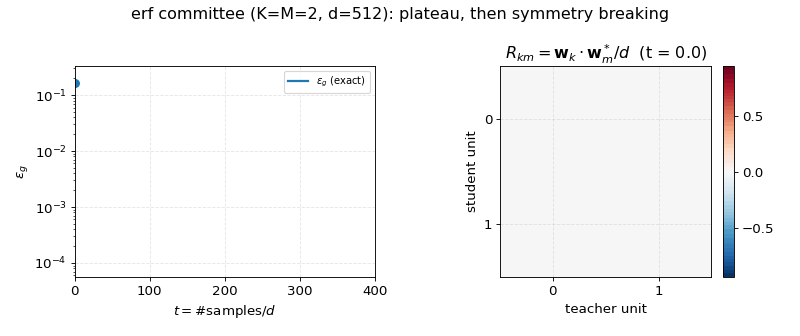
</p>
<p align="center"><em>
  <strong>Specialization-plateau escape</strong> (Saad&ndash;Solla setting, exact order parameters):
  the exact generalization error of an erf committee machine under online SGD stays trapped
  on the permutation-symmetric plateau, then drops when the student-teacher overlap matrix
  <em>R</em> (right) breaks symmetry and develops a diagonal. The escape time grows as ln&nbsp;d —
  a finite-size effect invisible in the d&rarr;&infin; ODE/DMFT theory
  (<code>statphys study plateau</code>).
</em></p>

<p align="center">
  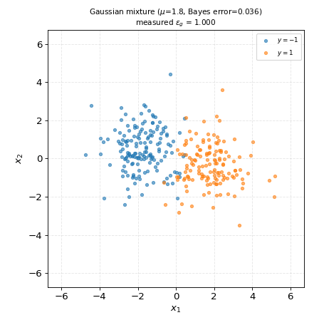
  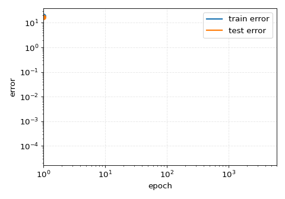
</p>
<p align="center"><em>
  Left: a 2D linear classifier's decision line rotating into place on Gaussian-mixture
  data — the measured generalization error (&epsilon;<sub>g</sub> &asymp; 0.037) matches the exact
  Bayes error (0.036) almost exactly.
  Right: <strong>grokking</strong> — train error collapses almost immediately, while test error
  plateaus for thousands of epochs before suddenly dropping (delayed generalization).
</em></p>

<p align="center">
  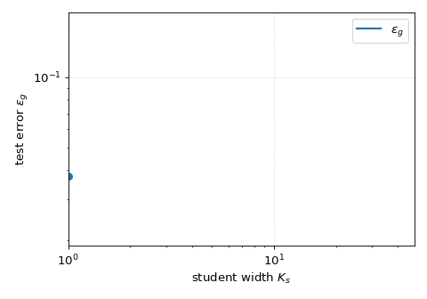
</p>
<p align="center"><em>
  <strong>Model-wise double descent</strong>: the test error traced as the student width grows —
  rising toward the interpolation threshold, then descending again in the
  overparameterized regime (<code>statphys study double_descent</code>).
</em></p>

<p align="center">
  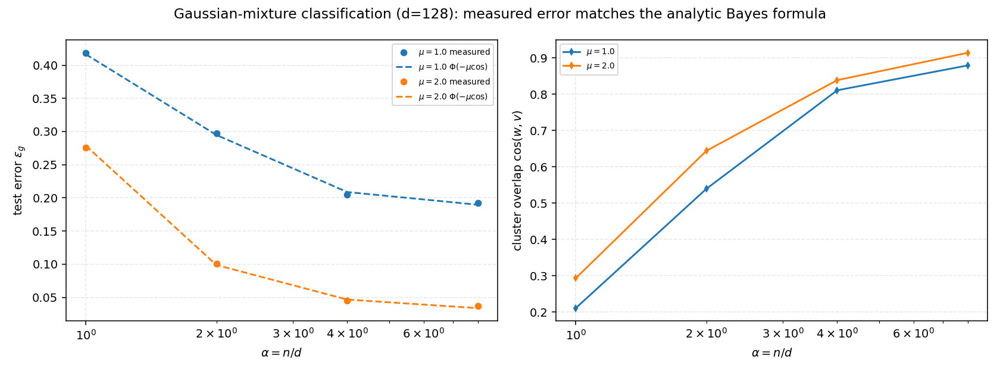
</p>
<p align="center"><em>
  The same Gaussian-mixture check (<code>statphys study mixture</code>) as a function of
  &alpha;: the numerically measured generalization error matches the exact analytic Bayes
  formula &Phi;(&minus;&mu; cos&theta;) at every &alpha; — a direct, literature-grounded
  check that the package's generalization-error bookkeeping is correct.
</em></p>

<p align="center">
  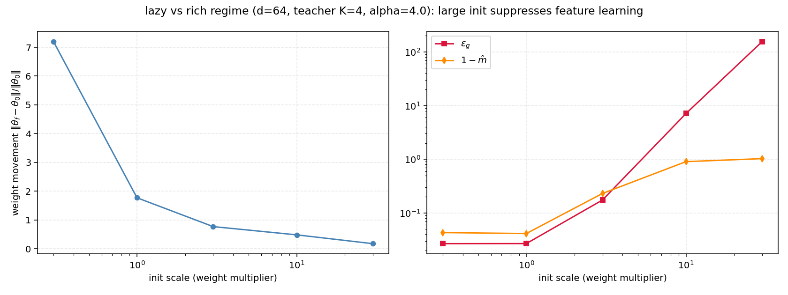
</p>
<p align="center"><em>
  Lazy vs. rich regimes (<code>statphys study lazy_rich</code>, Chizat &amp; Bach 2019): scaling up
  the initial weights suppresses relative weight movement (left) and prevents the
  student from specializing to the teacher's hidden directions, driving up the
  generalization error (right).
</em></p>

### Frontier gallery: beyond exact theory

<p align="center">
  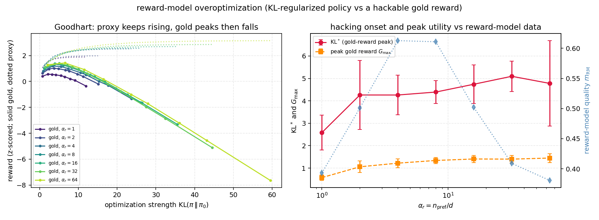
</p>
<p align="center"><em>
  <strong>Reward overoptimization</strong> (<code>statphys study rlhf</code>): a proxy reward model
  trained on pairwise preferences is optimized by a KL-regularized policy. The proxy reward
  (dotted) keeps rising while the <em>true</em> reward (solid) peaks and turns over — Goodhart's
  law as a phase boundary KL*(&alpha;<sub>r</sub>) that moves out as the reward model gets more data.
</em></p>

<p align="center">
  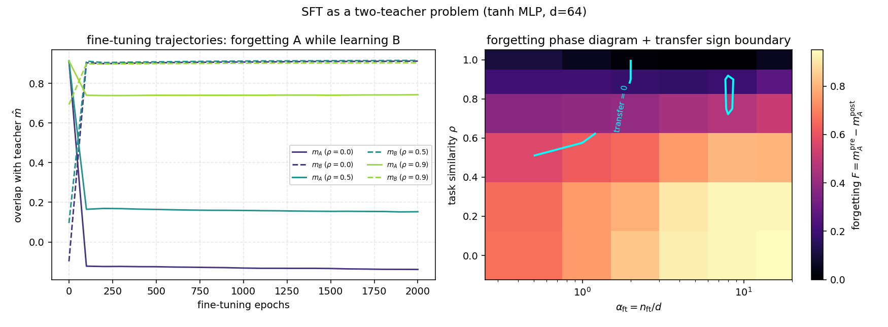
</p>
<p align="center"><em>
  <strong>SFT as a two-teacher problem</strong> (<code>statphys study sft</code>): fine-tuning on task B
  erases task A unless the tasks are similar; the (similarity, &alpha;<sub>ft</sub>) plane shows the
  forgetting phase diagram with the transfer-gain sign boundary in cyan.
</em></p>

<p align="center">
  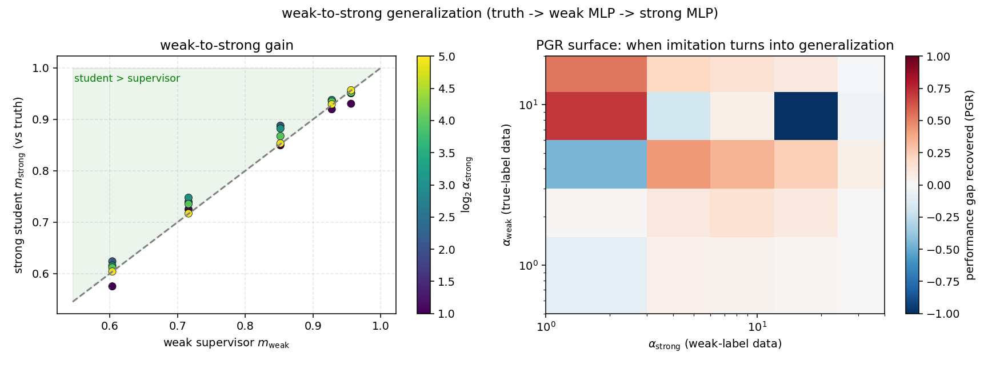
</p>
<p align="center"><em>
  <strong>Weak-to-strong generalization</strong> (<code>statphys study weak_to_strong</code>): a strong
  student trained only on a weak supervisor's labels consistently lands above the imitation
  diagonal; the PGR surface shows where the gains concentrate.
</em></p>

<p align="center">
  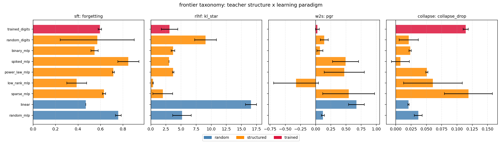
</p>
<p align="center"><em>
  <strong>Teacher taxonomy &times; paradigm</strong> (<code>statphys study taxonomy</code>): every teacher
  (random / structured / trained-on-real-images) through every frontier probe. Teacher structure
  moves every boundary — the Goodhart point spans a ~40&times; range across teacher ensembles.
</em></p>

<p align="center">
  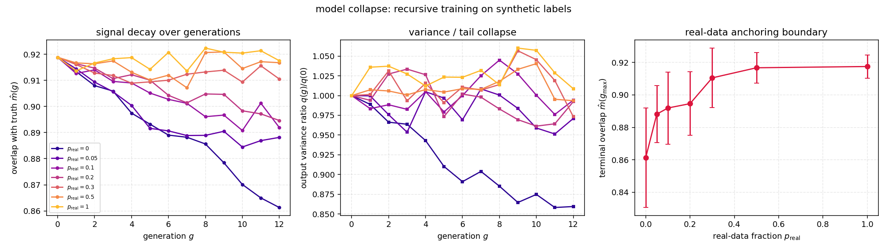
</p>
<p align="center"><em>
  <strong>Model collapse</strong> (<code>statphys study collapse</code>): retraining each generation on the
  previous generation's outputs erodes the teacher overlap and shrinks the output variance;
  a modest fraction of real data anchors the loop — the terminal overlap vs p<sub>real</sub>
  (right) is the collapse boundary.
</em></p>

<p align="center">
  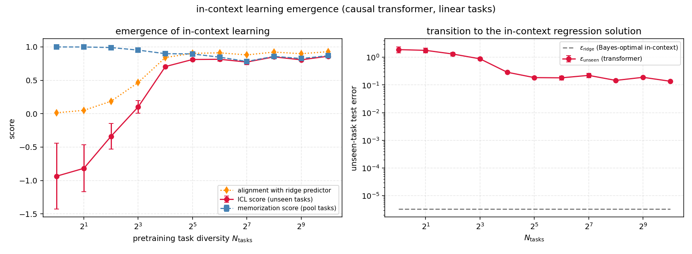
</p>
<p align="center"><em>
  <strong>Emergence of in-context learning</strong> (<code>statphys study icl</code>): a small causal
  transformer pretrained on a finite pool of regression tasks memorizes when the pool is small,
  then transitions to a genuine in-context regression algorithm (tracking the Bayes-optimal
  ridge predictor) once task diversity crosses N<sub>tasks</sub> &asymp; 8&ndash;16.
</em></p>

Verify the whole architecture zoo locally or as a Slurm job array:

```bash
python scripts/verify_architectures.py --arch all
python scripts/verify_architectures.py --submit-slurm --partition <name> --gpus 1
```

Run the test suite with `pytest tests/`.

## Documentation

Detailed documentation lives in [`docs/`](docs/README.md):

| Guide | Contents |
|---|---|
| [Getting Started](docs/getting_started.md) | Installation, one-liner API, full replica/online workflows |
| [Component Catalog](docs/components.md) | All datasets, models, losses, theory scenarios, and utilities |
| [General Experiments](docs/experiments.md) | Theory-free teacher-student framework, presets, architecture zoo |
| [Visualization](docs/visualization.md) | Plotters, phase portraits, and GIF/MP4 animations |
| [Slurm Guide](docs/slurm.md) | Cluster execution: single jobs, arrays, verification CLI |
| [Key Concepts](docs/concepts.md) | Order parameters, $E_g$ formulas, scaling conventions |
| [Order Parameters (full reference)](docs/order_parameters.md) | Every order parameter/generalization-error formula, with derivations: multi-index subspace overlap, Gaussian-mixture Bayes error, lazy/rich weight movement, LoRA adapter recovery |
| [Frontier Experiments](docs/frontier.md) | SFT, RLHF overoptimization, weak-to-strong, model collapse, ICL emergence — modern paradigms measured with physics order parameters |
| [Glossary](docs/glossary.md) | Statistical-physics ↔ ML dictionary, for readers with no stat-mech background |
| [Paper draft](paper/README.md) | *Phase Diagrams Without Solvable Models* — a paper built entirely from the frontier studies of this repository (LaTeX + figures) |
| [Theory & Literature](docs/THEORY.md) | Feature ↔ paper map; exact vs heuristic status |
| [Package Structure](docs/package_structure.md) | Source-tree layout and design conventions |

## Examples

See the [`examples/`](examples/) directory:

| File | Description |
|------|-------------|
| `basic_usage.ipynb` | Comprehensive tutorial covering all features |
| `dataset_gallery.ipynb` | Visualization of all 22 supported datasets |
| `model_gallery.ipynb` | Visualization of all 19 supported models |
| `theory_vs_simulation_verification_en.ipynb` | Theory vs simulation walkthrough (also [日本語](examples/theory_vs_simulation_verification_ja.ipynb)) |
| `replica_ridge_regression.py` | Ridge regression with replica theory |
| `online_sgd_learning.py` | Online SGD dynamics |
| `committee_machine.py` | Committee machine analysis |
| `general_teacher_student.py` | Theory-free experiments (sparse recovery, attention teacher, custom setups) |

## License

BSD-3-Clause License — see [LICENSE.txt](LICENSE.txt) for details.

## Contributing

Contributions are welcome! Please read our [Contributing Guide](CONTRIBUTING.md) and [Code of Conduct](CODE_OF_CONDUCT.md) before submitting a Pull Request.

## Citation

If you use this package in your research, please cite:

```bibtex
@software{ichikawa2025statphysml,
  author       = {Ichikawa, Yuma},
  title        = {{StatPhys-ML}: Statistical Mechanics Simulation Package for Machine Learning},
  year         = {2025},
  month        = feb,
  version      = {0.1.0},
  publisher    = {GitHub},
  url          = {https://github.com/yuma-ichikawa/statphys-ml},
  note         = {Python package for Teacher-Student model analysis using replica method and online learning theory}
}
```

## Author

**Yuma Ichikawa, Ph.D.**

- **Website**: [https://ichikawa-laboratory.com/](https://ichikawa-laboratory.com/)
- **Twitter**: [@yuma_1_or](https://x.com/yuma_1_or)
- **Google Scholar**: [Yuma Ichikawa](https://scholar.google.com/citations?user=yuma-ichikawa)
- **GitHub**: [yuma-ichikawa](https://github.com/yuma-ichikawa)
- **Email**: yuma.ichikawa@a.riken.jp

## Disclaimer

This project is an **independent personal project** developed by Yuma Ichikawa.
It is **not affiliated with, sponsored by, or endorsed by any organization**, including the author's employer.
All views and opinions expressed in this project are solely those of the author.

## Phase-continuation research program

The unified numerical program is organized by realism tier rather than labeling every proxy
as a realistic model:

- **Tier A:** exact or oracle anchors.
- **Tier B:** reduced-order and matched-latent continuations.
- **Tier B+:** trainable decoder Transformer, MLP/U-Net/DiT denoisers, POMDP policies, and
  neural agent populations.
- **Tier C:** natural-language, natural-image, external-RLVR, and LLM-agent protocols. These
  remain explicitly incomplete until versioned external assets are supplied.

Every condition uses its exact registered seed set with at least five outer
seeds; frozen follow-up studies may register stronger replication.
Run 'phase-continuation coverage' and 'phase-continuation taxonomy' before creating manifests.
Reusable code and profiles contain no site-specific absolute paths.
