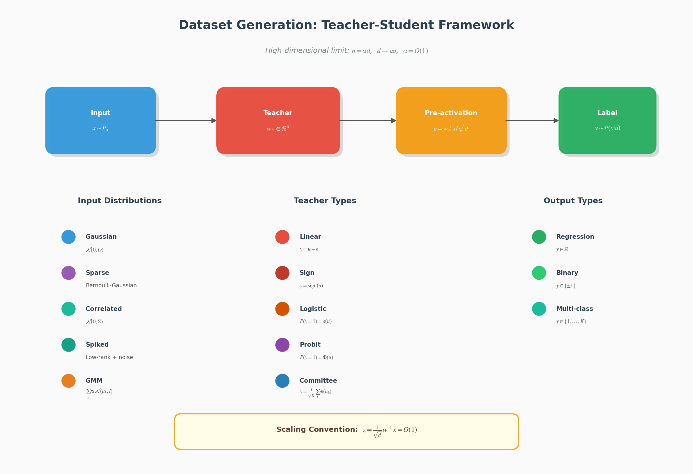
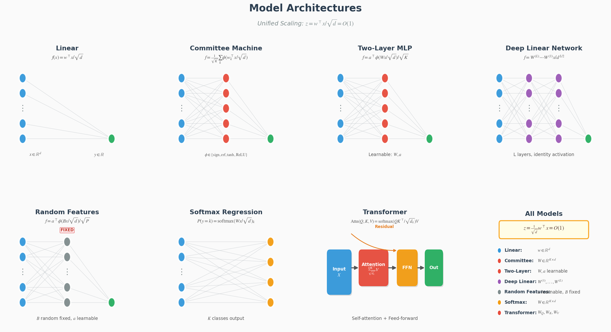

# Component Catalog

Full listing of the building blocks. Every component follows the same pattern: pick a **dataset** (teacher), a **model** (student), a **loss**, and optionally a matching **theory scenario**.

## Datasets (22 types)

| Category | Class | Description |
|----------|-------|-------------|
| **Gaussian** | `GaussianDataset` | Standard i.i.d. Gaussian input with linear teacher |
| | `GaussianClassificationDataset` | Sign teacher for binary classification |
| | `GaussianMultiOutputDataset` | Multi-output teacher (committee-style) |
| **Sparse** | `SparseDataset` | Sparse input distribution |
| | `BernoulliGaussianDataset` | Bernoulli-Gaussian mixture input |
| **Structured** | `StructuredDataset` | Arbitrary covariance matrix |
| | `CorrelatedGaussianDataset` | Exponentially correlated input |
| | `SpikedCovarianceDataset` | Spiked covariance model |
| **GLM Teachers** | `LogisticTeacherDataset` | Logistic teacher: $P(y=1 \mid u) = \sigma(u)$ |
| | `ProbitTeacherDataset` | Probit teacher: $P(y=1 \mid u) = \Phi(u)$ |
| **Gaussian Mixture** | `GaussianMixtureDataset` | Binary GMM (for DMFT analysis) |
| | `MulticlassGaussianMixtureDataset` | Multi-class GMM |
| **ICL Tasks** | `ICLLinearRegressionDataset` | ICL task with linear teacher (for LSA analysis) |
| | `ICLNonlinearRegressionDataset` | ICL task with nonlinear (2-layer) teacher |
| **Sequence/Token** | `MarkovChainDataset` | Markov chain sequences (for induction head) |
| | `CopyTaskDataset` | Copy/trigger task (induction head emergence) |
| | `GeneralizedPottsDataset` | Language-like Potts sequences (Phys. Rev. 2024) |
| | `TiedLowRankAttentionDataset` | Position-semantics phase transition (NeurIPS 2024) |
| | `MixedGaussianSequenceDataset` | Correlated token sequences with latent clusters |
| **Attention** | `AttentionIndexedModelDataset` | AIM for Bayes-optimal attention (arXiv 2025) |
| **Fairness** | `TeacherMixtureFairnessDataset` | Fairness/bias with group teachers (ICML 2024) |
| **Noisy Labels** | `NoisyGMMSelfDistillationDataset` | Label noise for self-distillation (2025) |

  

<em>Teacher-Student framework for data generation</em>

## Models (19 types)

| Category | Class | Description |
|----------|-------|-------------|
| **Linear** | `LinearRegression` | Linear regression with $1/\sqrt{d}$ scaling |
| | `LinearClassifier` | Linear classifier (sign/logit/prob output) |
| | `RidgeRegression` | Ridge regression wrapper |
| **Committee** | `CommitteeMachine` | Hard committee (sign activation) |
| | `SoftCommitteeMachine` | Soft committee (erf/tanh/relu) |
| **MLP** | `TwoLayerNetwork` | Two-layer network with various activations |
| | `TwoLayerNetworkReLU` | Two-layer ReLU network |
| | `DeepNetwork` | Multi-layer network |
| **Deep Linear** | `DeepLinearNetwork` | Deep linear network (identity activation) |
| **Random Features** | `RandomFeaturesModel` | Random features / kernel approximation |
| | `KernelRidgeModel` | Kernel ridge regression wrapper |
| **Softmax** | `SoftmaxRegression` | Multi-class softmax regression |
| | `SoftmaxRegressionWithBias` | Softmax with bias terms |
| **Transformer** | `SingleLayerAttention` | Single attention layer |
| | `SingleLayerTransformer` | Full single-layer transformer |
| **Sequence Models** | `LinearSelfAttention` | Linear self-attention (LSA) for ICL theory |
| | `StateSpaceModel` | State space model (SSM) for sequences |
| | `LinearRNN` | Linear recurrent neural network |
| **Energy-Based** | `ModernHopfieldNetwork` | Modern Hopfield network (attention ≈ energy min) |

  

<em>Supported model architectures with unified scaling convention</em>

For architecture-zoo teacher-student pairs (CNN, LSTM, tiny GPT, ...), see [experiments.md](experiments.md).

## Loss Functions (16 types)

| Category | Class | Formula |
|----------|-------|---------|
| **Regression** | `MSELoss` | $\frac{1}{2}(y - \hat{y})^2$ |
| | `RidgeLoss` | $\text{MSE} + \lambda \|\mathbf{w}\|_2^2$ |
| | `LassoLoss` | $\text{MSE} + \lambda \|\mathbf{w}\|_1$ |
| | `ElasticNetLoss` | $\text{MSE} + \lambda_1 \|\mathbf{w}\|_1 + \lambda_2 \|\mathbf{w}\|_2^2$ |
| | `HuberLoss` | Smooth robust loss |
| | `PseudoHuberLoss` | Differentiable Huber |
| **Binary Classification** | `CrossEntropyLoss` | Binary cross-entropy |
| | `LogisticLoss` | $\log(1 + e^{-y \hat{y}})$ |
| | `HingeLoss` | $\max(0, 1 - y\hat{y})$ |
| | `SquaredHingeLoss` | $\max(0, 1 - y\hat{y})^2$ |
| | `PerceptronLoss` | $\max(0, -y\hat{y})$ |
| | `ExponentialLoss` | $e^{-y\hat{y}}$ |
| | `RampLoss` | Bounded hinge loss |
| | `ProbitLoss` | $-\log \Phi(y\hat{y})$ |
| **Multi-class** | `SoftmaxCrossEntropyLoss` | Softmax + cross-entropy |
| | `MultiMarginLoss` | Multi-class hinge (Crammer-Singer) |

Loss scaling conventions for replica vs online simulations are explained in [concepts.md](concepts.md#loss-function-scaling).

## Theory Equations

### Replica Method (6 scenarios)

| Full Class Name | Short Alias | Problem |
|-----------------|-------------|---------|
| `GaussianLinearRidgeEquations` | `RidgeRegressionEquations` | Ridge regression saddle-point equations |
| `GaussianLinearLassoEquations` | `LassoEquations` | LASSO with soft-thresholding |
| `GaussianLinearLogisticEquations` | `LogisticRegressionEquations` | Logistic regression |
| `GaussianLinearHingeEquations` | `PerceptronEquations` | Perceptron/SVM (Gardner volume) |
| `GaussianLinearProbitEquations` | `ProbitEquations` | Probit classification |
| `GaussianCommitteeMseEquations` | `CommitteeMachineEquations` | Committee machine (symmetric ansatz) |

### Online Learning (6 scenarios)

| Full Class Name | Short Alias | Problem |
|-----------------|-------------|---------|
| `GaussianLinearMseEquations` | `OnlineSGDEquations` | Online SGD for linear regression |
| `GaussianLinearRidgeEquations` | `OnlineRidgeEquations` | Online ridge regression |
| `GaussianLinearPerceptronEquations` | `OnlinePerceptronEquations` | Online perceptron learning |
| `GaussianLinearLogisticEquations` | `OnlineLogisticEquations` | Online logistic regression |
| `GaussianLinearHingeEquations` | `OnlineHingeEquations` | Online SVM/hinge loss |
| `GaussianCommitteeMseEquations` | `OnlineCommitteeEquations` | Online committee machine (erf) |

Which scenarios are exact vs heuristic, with literature references, is documented in [THEORY.md](THEORY.md).

## Utilities

### Special Functions (`statphys.utils.special_functions`)

| Function | Description |
|----------|-------------|
| `gaussian_pdf`, `gaussian_cdf`, `gaussian_tail` | Gaussian distribution functions |
| `Phi`, `H`, `phi` | Standard notation aliases |
| `erf_activation`, `erf_derivative` | Error function activation |
| `sigmoid`, `sigmoid_derivative` | Sigmoid and derivative |
| `I2`, `I3`, `I4` | Committee machine correlation functions ($I_2, I_3, I_4$) |
| `soft_threshold`, `firm_threshold` | Proximal operators |
| `classification_error_linear`, `regression_error_linear` | Generalization error formulas |

### Numerical Integration (`statphys.utils.integration`)

| Function | Description |
|----------|-------------|
| `gaussian_integral_1d` | Univariate Gaussian integral |
| `gaussian_integral_2d` | Bivariate Gaussian integral |
| `gaussian_integral_nd` | Multivariate Gaussian integral |
| `teacher_student_integral` | Joint $(u, z)$ integral for teacher-student |
| `conditional_expectation` | $\mathbb{E}[f(z) \mid u]$ or $\mathbb{E}[f(u) \mid z]$ |

Integration methods: `hermite` (Gauss-Hermite quadrature, recommended), `quad` (scipy adaptive), `monte_carlo` (high dimensions).

### Other utilities

| Module | Contents |
|--------|----------|
| `statphys.utils.order_params` | Automatic order-parameter extraction (see [concepts.md](concepts.md#automatic-order-parameter-calculation)) |
| `statphys.utils.constants` | Centralized numerical constants (epsilons, clips, integration bounds, solver defaults) |
| `statphys.utils.slurm` | Slurm job generation and submission (see [slurm.md](slurm.md)) |
| `statphys.utils.seed` | `fix_seed`, `get_device`, seed lists |
| `statphys.utils.io` | Results saving/loading (`ResultsManager`) |
