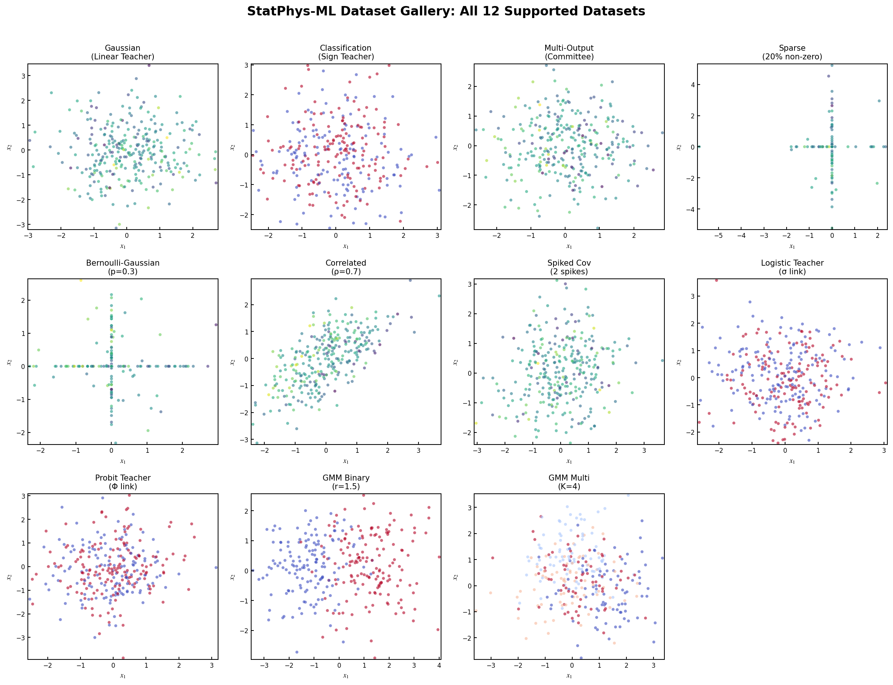
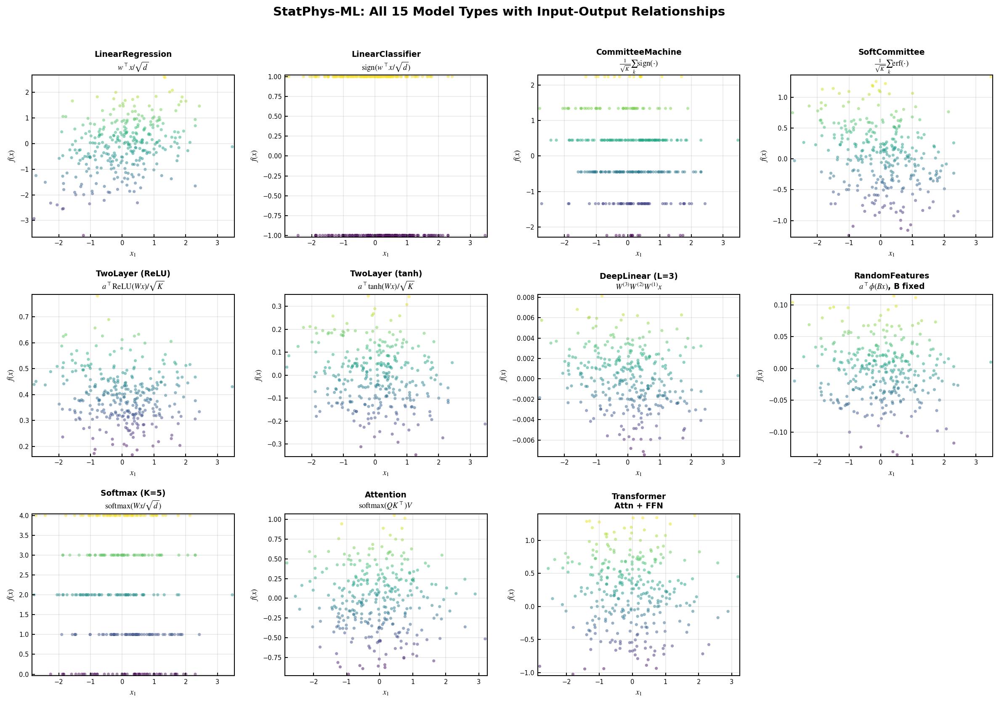

# Examples

Example scripts and notebooks demonstrating `statphys-ml` usage.

## Contents

| File | Description |
|------|-------------|
| `basic_usage.ipynb` | Comprehensive tutorial covering all features |
| `dataset_gallery.ipynb` | Visualization of all 12 supported datasets |
| `model_gallery.ipynb` | **NEW**: Visualization of all 15 supported models |
| `replica_ridge_regression.py` | Ridge regression with replica theory |
| `online_sgd_learning.py` | Online SGD learning dynamics |
| `committee_machine.py` | Soft committee machine analysis |

## Quick Start

```bash
# Install the package
pip install -e .

# Run a script
python examples/replica_ridge_regression.py

# Or open the notebook
jupyter notebook examples/basic_usage.ipynb
```

## Notebooks

### `basic_usage.ipynb`
Comprehensive tutorial covering:
- Package import and setup
- Dataset generation (Gaussian, Classification)
- Model creation (Linear, Committee)
- Loss functions (Ridge, MSE)
- Running simulations (Replica, Online)
- Visualization tools

### `dataset_gallery.ipynb`
Visual gallery of all supported datasets:

| Category | Datasets |
|----------|----------|
| **Gaussian** | `GaussianDataset`, `GaussianClassificationDataset`, `GaussianMultiOutputDataset` |
| **Sparse** | `SparseDataset`, `BernoulliGaussianDataset` |
| **Structured** | `StructuredDataset`, `CorrelatedGaussianDataset`, `SpikedCovarianceDataset` |
| **GLM Teachers** | `LogisticTeacherDataset`, `ProbitTeacherDataset` |
| **Gaussian Mixture** | `GaussianMixtureDataset`, `MulticlassGaussianMixtureDataset` |



### `model_gallery.ipynb`
Visual gallery of all 15 supported models with architecture diagrams and I/O relationships:

| Category | Models |
|----------|--------|
| **Linear** | `LinearRegression`, `LinearClassifier`, `RidgeRegression` |
| **Committee** | `CommitteeMachine`, `SoftCommitteeMachine` |
| **MLP** | `TwoLayerNetwork`, `TwoLayerNetworkReLU`, `DeepNetwork` |
| **Deep Linear** | `DeepLinearNetwork` |
| **Random Features** | `RandomFeaturesModel`, `KernelRidgeModel` |
| **Softmax** | `SoftmaxRegression`, `SoftmaxRegressionWithBias` |
| **Transformer** | `SingleLayerAttention`, `SingleLayerTransformer` |


